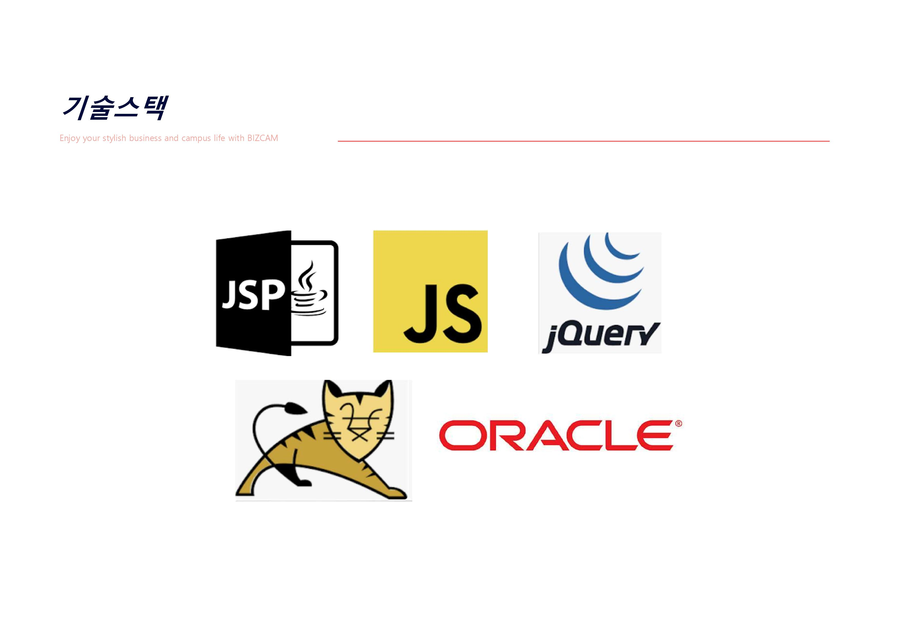
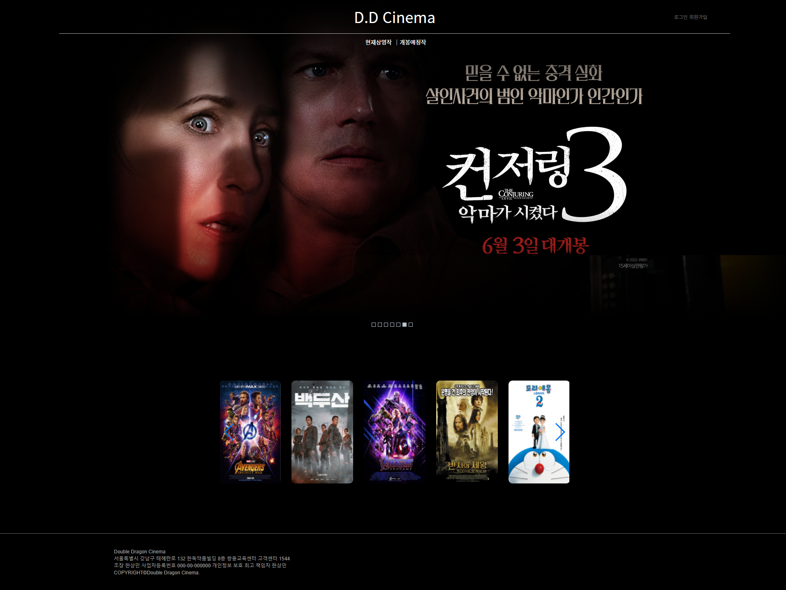
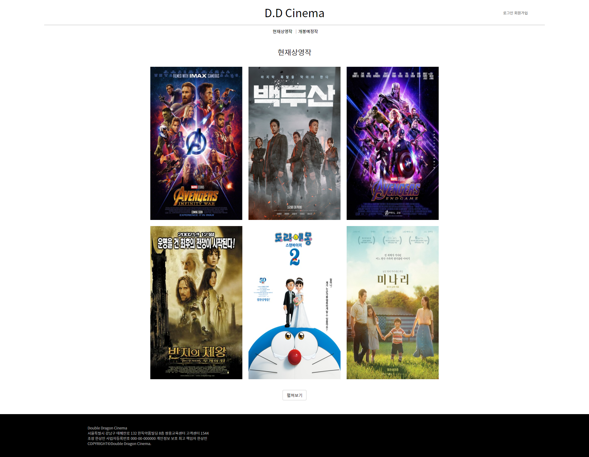
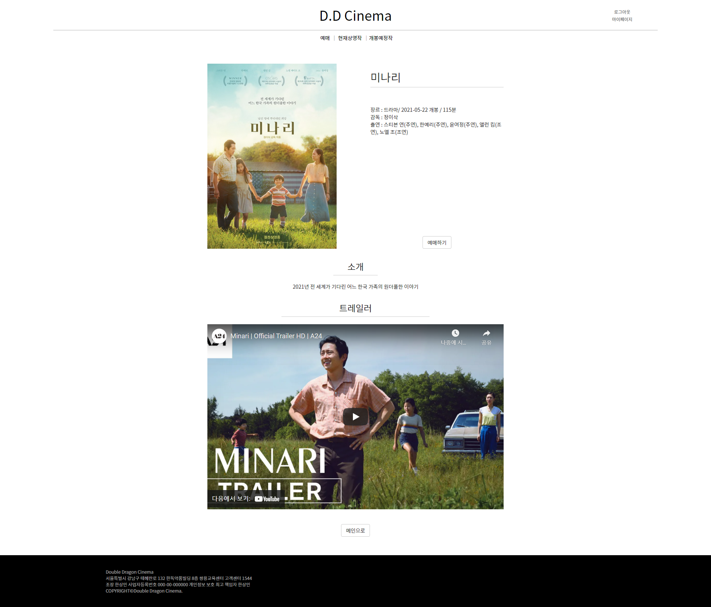
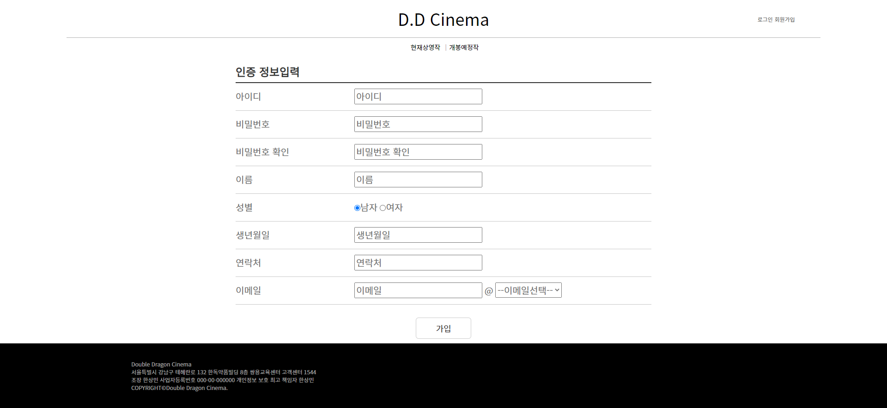
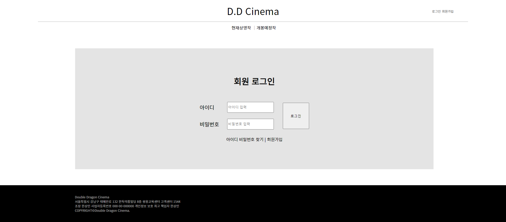

# 영화 예매 웹 프로젝트

본 프로젝트는 JSP기반의 영화 예매 웹 프로젝트입니다.

## 참여 인원

- 팀장 : 한상민

- 팀원 : 이하늘, 진재혁, 이학민, 이상철

## 역할 분담

- 한상민

  - 회원관리 페이지 및 DAO 구현.

  - 사용자 회원 관련 페이지 및 DAO 구현.

- 이하늘

  - 전체적인 디자인.

  - 메인 페이지 구현.

  - 영화 정보 관련 사용자 페이지 및 DAO 구현.

  - 영화 관리 페이지 및 DAO 일부 구현.

  - 회원 관리 DAO 일부 구현.

- 진재혁

  - 영화 스케줄, 예매 관련 페이지 및 DAO 구현.

  - DB 작성.

- 이학민

  - 영화 관리 페이지 및 DAO 구현.

- 이상철

  - 회원관리, 로그인 페이지 및 DAO 구현.

## 기술 스택

## DB

## Class Diagram

## 구현

### 메인 페이지

### 영화 목록

### 영화 정보

### 회원가입

### 로그인

