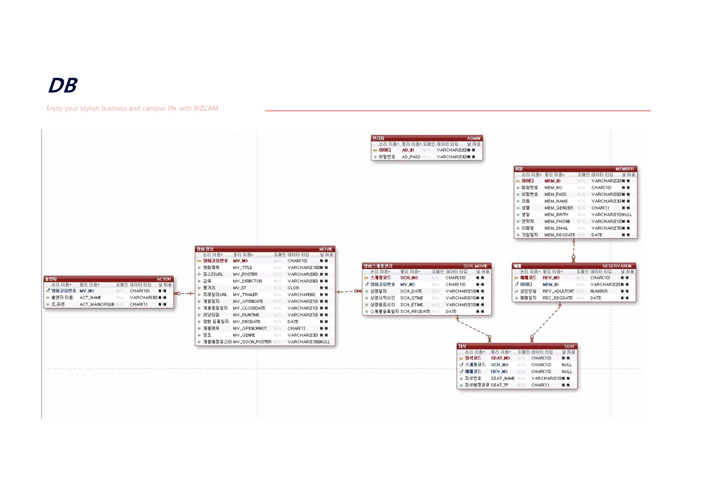
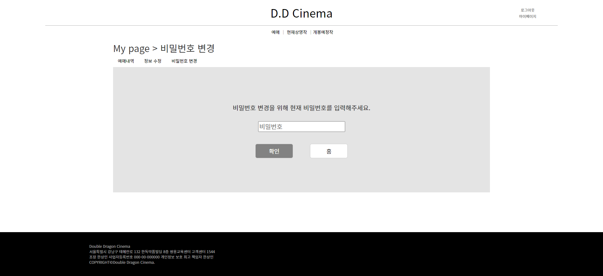

# 영화 예매 웹 프로젝트

본 프로젝트는 JSP 기반의 영화 예매 웹 프로젝트입니다.

## 참여 인원

- 팀장 : 한상민

- 팀원 : 이하늘, 진재혁, 이학민, 이상철

## 역할 분담

- 한상민

  - 회원관리 페이지 및 DAO 구현.

  - 사용자 회원 관련 페이지 및 DAO 구현.

- 이하늘

  - 전체적인 디자인.

  - 메인 페이지 구현.

  - 영화 정보 관련 사용자 페이지 및 DAO 구현.

  - 영화 관리 페이지 및 DAO 일부 구현.

  - 회원 관리 DAO 일부 구현.

- 진재혁

  - 영화 스케줄, 예매 관련 페이지 및 DAO 구현.

  - DB 작성.

- 이학민

  - 영화 관리 페이지 및 DAO 구현.

- 이상철

  - 회원관리, 로그인 페이지 및 DAO 구현.

## 기술 스택

## DB

## Class Diagram

## 구현

### 메인 페이지

    메인페이지에서 슬라이더를 통해 현재 상영작과 개봉 예정작을 볼 수 있습니다.

### 영화 목록

    영화 목록은 현재 상영작과 개봉 예정작으로 나뉘어져 있습니다.

### 영화 정보

    영화 목록에서 영화를 선택하면 해당 영화에 대한 상세정보 확인과 예매가 가능합니다.

### 회원가입

    정보를 기입하여 회원가입이 가능합니다.

### 로그인

    가입한 계정으로 로그인을 합니다. 로그인을 하지 않으면 예매를 할 수 없습니다.

### 아이디, 비밀번호 찾기

    필요 정보를 기입하여 아이디와 비밀번호를 찾을 수 있습니다.

### 마이 페이지

    마이페이지에서 예매내역 확인과 정보 수정, 비밀번호 변경이 가능합니다.

### 예매

### 관리자

    관리자는 로그인 후에 관리자 페이지에서 상영작 관리, 상영스케줄 관리, 회원 관리가 가능합니다.

